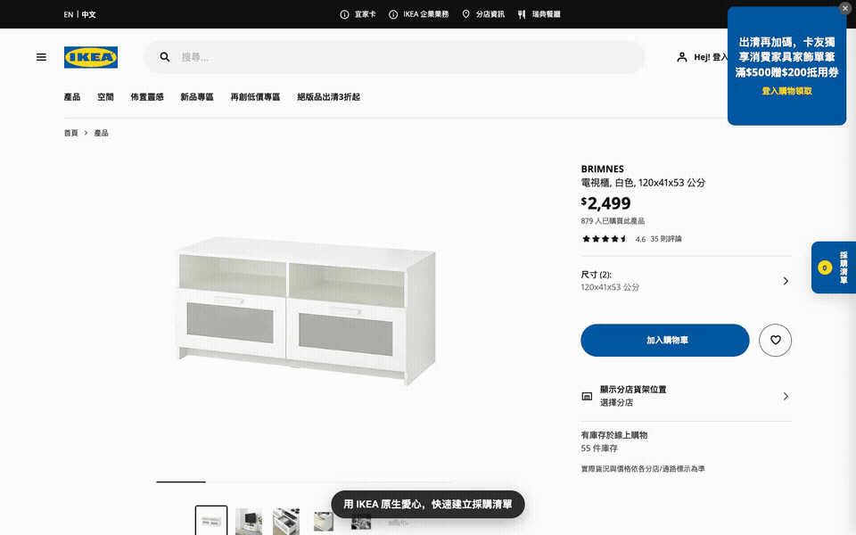

# IKEA 採購清單小幫手

一款支援 IKEA 台灣與香港官網的 Chrome 擴充功能。瀏覽商品時，不需要登入 IKEA 帳號，就能使用官網原生愛心按鈕收藏商品、依空間整理採購清單、自動計算預算，並將清單匯出成 PDF 或透過 Email 分享。

> 本工具由第三方獨立開發，非 IKEA 官方服務。

## 操作示範

[](docs/assets/ikea-wishlist-demo.mp4)

點選上方影片可開啟高畫質 MP4。

操作流程：點選商品愛心 → 選擇空間 → 開啟採購清單 → 查看分類與總金額 → 匯出 PDF。

## 主要功能

- **免登入收藏**：攔截 IKEA 官網原生愛心按鈕，將商品直接儲存在瀏覽器本機。
- **依空間分類**：內建客廳、臥室、書房、浴室、陽台、廚房、餐廳與玄關，也可以新增自訂空間。
- **預算自動加總**：即時計算各空間小計與整份清單總金額。
- **數量與單價調整**：可修改商品數量，也能直接編輯單價。
- **商品管理**：支援移動空間、單筆刪除、篩選後全選與批次刪除。
- **匯出 PDF**：產生包含空間分類、商品明細、小計與總金額的採購清單。
- **Email 分享**：開啟預設郵件軟體，帶入清單主旨與文字內容。
- **備份與還原**：PDF 內包含清單備份文字，可在設定中貼上並選擇要還原的商品。
- **台灣／香港分開儲存**：兩個市場的清單與幣別互不混用，分別顯示 NT$ 與 HK$。
- **IKEA Planner 支援**：可將 Planner 設計組合加入清單，手動確認名稱、設計編號、金額與空間。

## 安裝方式

目前以「載入未封裝擴充功能」的方式安裝：

1. 下載或 clone 此專案。
2. 在 Chrome 網址列輸入 `chrome://extensions`。
3. 開啟右上角的「開發人員模式」。
4. 點選「載入未封裝項目」。
5. 選擇此專案的 `ikea-wishlist-extension` 資料夾。
6. 前往 [IKEA 台灣](https://www.ikea.com.tw/zh) 或 [IKEA 香港](https://www.ikea.com.hk/zh) 官網開始使用。

更新程式碼後，請回到 `chrome://extensions` 按下重新載入，再重新整理 IKEA 網頁。

## 使用方式

### 收藏商品

在商品列表、搜尋結果、推薦商品或單一商品頁，點選 IKEA 官網原本的愛心按鈕。擴充功能會顯示空間選單，選擇後商品便會加入採購清單。

如果商品已在清單中，再次點選愛心可以移動到其他空間或移除收藏。

### 管理採購清單

點選頁面右側的「採購清單」標籤開啟面板，可以：

- 依空間篩選商品。
- 增減商品數量。
- 點選金額修改單價。
- 將商品移動到其他空間。
- 勾選多項商品後批次刪除。
- 點選商品名稱回到 IKEA 商品頁。

### 匯出 PDF

在清單面板底部點選「匯出 PDF」，Chrome 會開啟列印視窗。將目的地選為「另存為 PDF」即可儲存。

PDF 末端會附上備份文字。如果清單日後遺失，可以複製該段文字，前往「設定 → 從備份還原」重新匯入。

### Email 分享

在清單面板底部點選「Email 寄送清單內容」，擴充功能會使用 `mailto:` 開啟電腦的預設郵件軟體，並自動帶入主旨與清單文字。

此功能不會自動附加 PDF；如需附件，請先匯出 PDF 後自行加入郵件。

### IKEA Planner 設計組合

在 `planner.ikea.com.tw` 或 `planner.ikea.com.hk` 的設計頁面，右下角會顯示「加入採購清單」按鈕。

由於 Planner 不一定提供可穩定讀取的完整價格資料，加入前會開啟確認表單，讓使用者自行檢查或修改：

- 設計名稱
- 設計編號
- 金額
- 所屬空間

## 資料與隱私

- 商品清單與設定儲存在 `chrome.storage.local`。
- 資料只存在目前使用的 Chrome profile，不會上傳到專案作者的伺服器。
- 不需要 IKEA 帳號、API 金鑰或第三方服務帳號。
- Email 功能只會開啟本機預設郵件軟體，不會由擴充功能代為寄信。

## 支援網站

- `https://www.ikea.com.tw/*`
- `https://www.ikea.com.hk/*`
- `https://planner.ikea.com.tw/*`
- `https://planner.ikea.com.hk/*`

## 已知限制

- IKEA 官網改版後，商品愛心或資料擷取方式可能需要同步調整。
- IKEA 香港部分頁面的收藏元件可能與台灣版不同，需要依實際頁面持續驗證。
- Planner 的價格與完整零件資訊無法保證自動取得，必要時需手動輸入。
- Email 分享使用 `mailto:`，是否能正常開啟取決於電腦是否已設定預設郵件軟體。
- 備份還原只支援本擴充功能產生的備份格式。

## 專案結構

```text
ikea-wishlist-extension/
├── manifest.json
├── background/
│   └── service-worker.js
├── content/
│   ├── content-script.js
│   ├── panel.js
│   ├── site-adapter.js
│   └── storage.js
├── docs/
│   └── assets/
└── icons/
```

- `manifest.json`：Chrome Extension Manifest V3 設定。
- `background/service-worker.js`：處理工具列圖示與面板切換。
- `content/content-script.js`：掛載介面並攔截收藏操作。
- `content/panel.js`：採購清單、設定、匯出與還原介面。
- `content/site-adapter.js`：讀取 IKEA 商品與 Planner 資料。
- `content/storage.js`：本機資料儲存與清單操作。

## 開發與驗證

此專案不需要建置工具或套件安裝。修改 JavaScript 後，可先執行語法檢查：

```bash
node --check background/service-worker.js
node --check content/content-script.js
node --check content/panel.js
node --check content/site-adapter.js
node --check content/storage.js
```

接著在 `chrome://extensions` 重新載入擴充功能，並於 IKEA 台灣、香港及 Planner 頁面實際測試。
